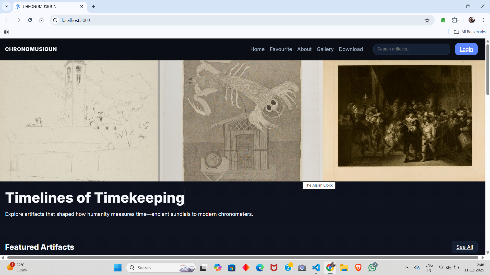
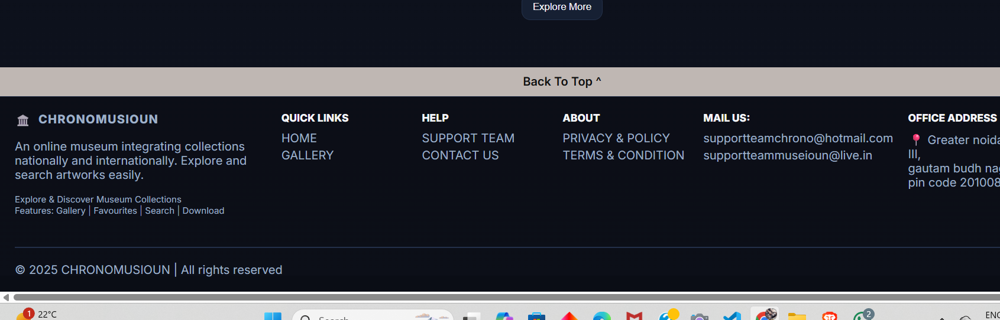
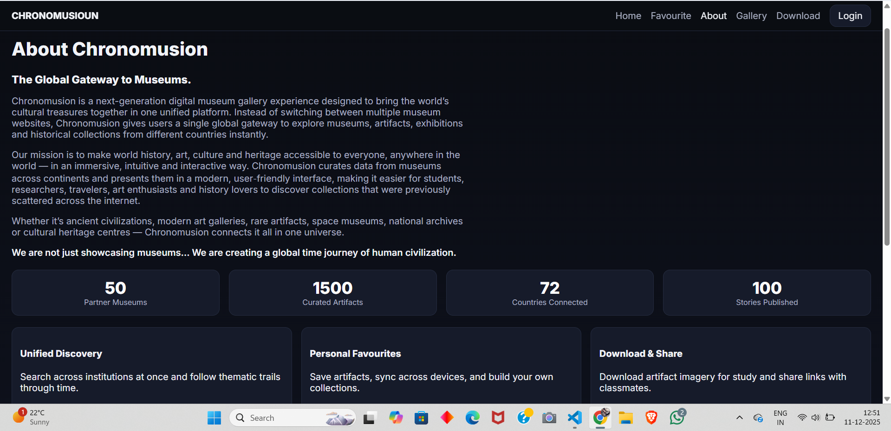
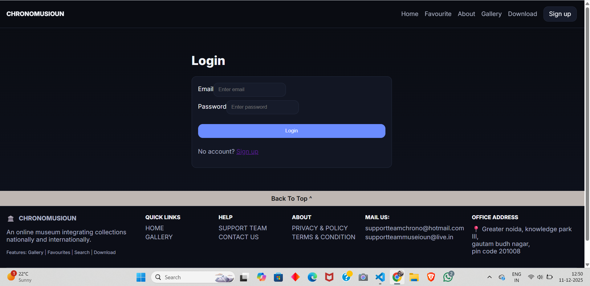
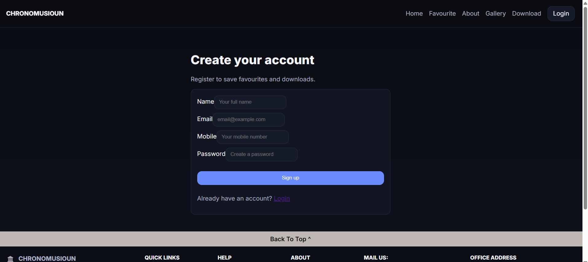

# CHRONOMUSIOUN

A full-stack museum website featuring timekeeping artifacts.

## Features
- Navbar with logo, Home, Favourite, About, Gallery, Download, Search, Login
- Hero section with side scrollable image area
- Gallery grid with details, favourite toggle, and download
- Search across title/description/year
- Simple login (mock) with cookie; favorites sync to server
- Footer

## Tech
- Backend: Node.js, Express
- Frontend: Vanilla HTML/CSS/JS

## Setup
```bash
npm install
npm run start
```
Open `http://localhost:3000`.

## Notes
- Images use Unsplash sample URLs.
- Downloads are proxied via `/download/:id` to add attachment headers.
- Favorites persist locally in `localStorage` and sync to server when logged in.













